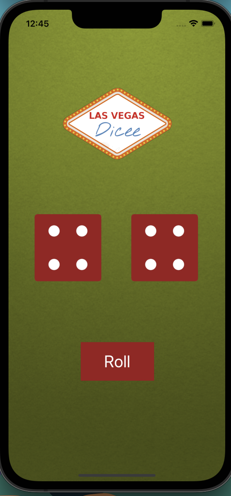
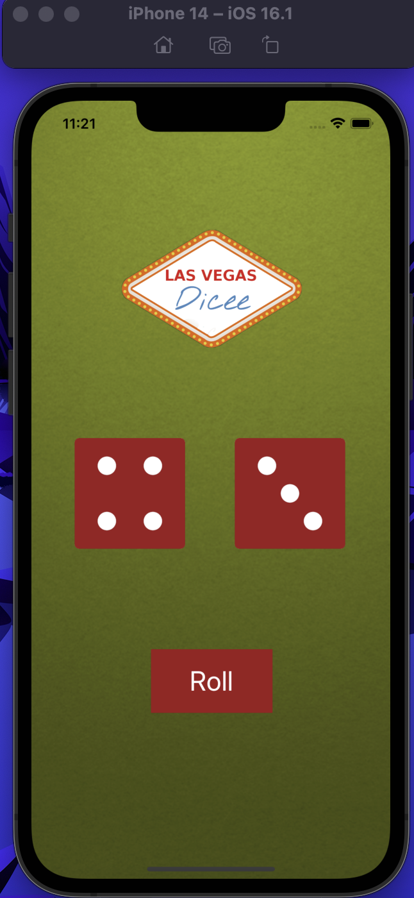

# Dice-IOS

## Our Goal

Creating a Las Vegas dice app. You can make the die roll at the press of a button or by shaking your phone. 

## What I Learned 
* Create an app with behaviour and functionality.
* Create links between the Interface Builder files and code using IBActions and IBOutlets.
* Get familiar with the Xcode code editor.
* Understand and use Swift constants and variables.
* Understand and use collection types such as Swift arrays.
* Test and debug app with the Xcode console.
* Learn about randomisation and how to generate random numbers in Swift.

